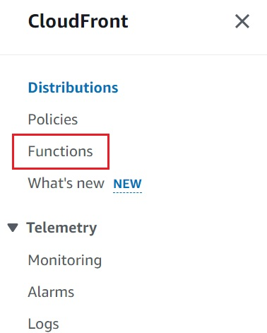
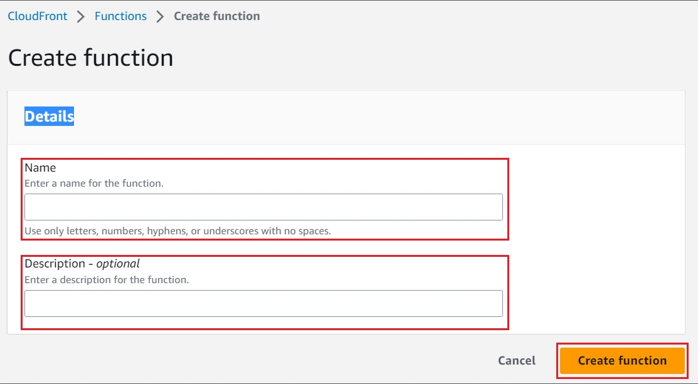
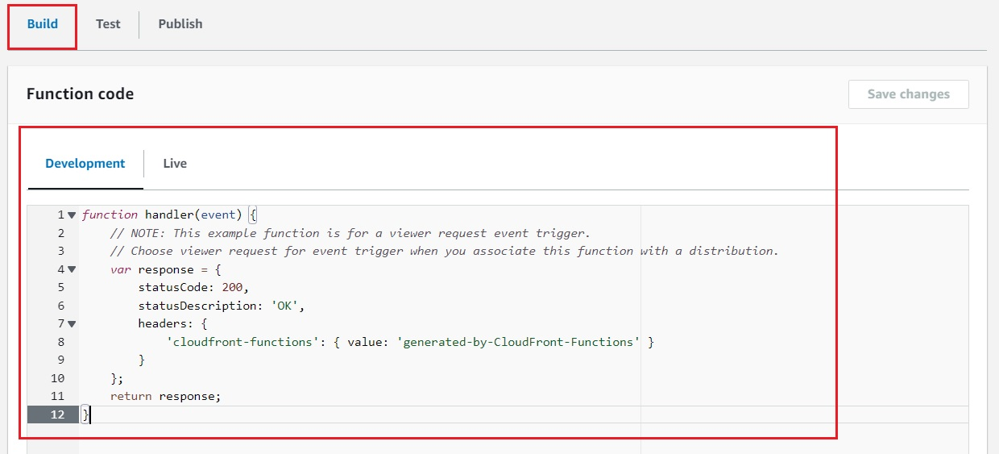
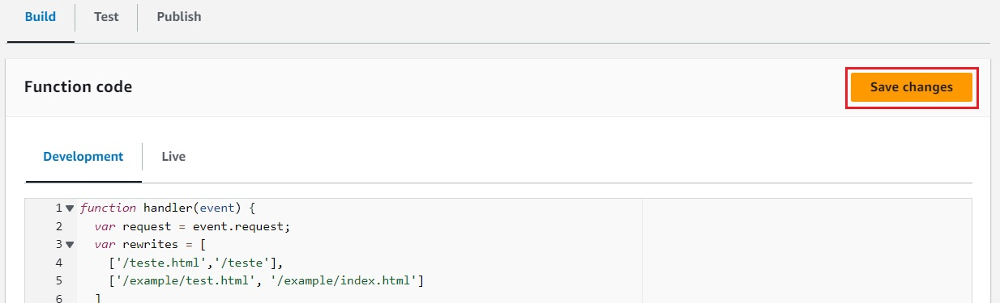
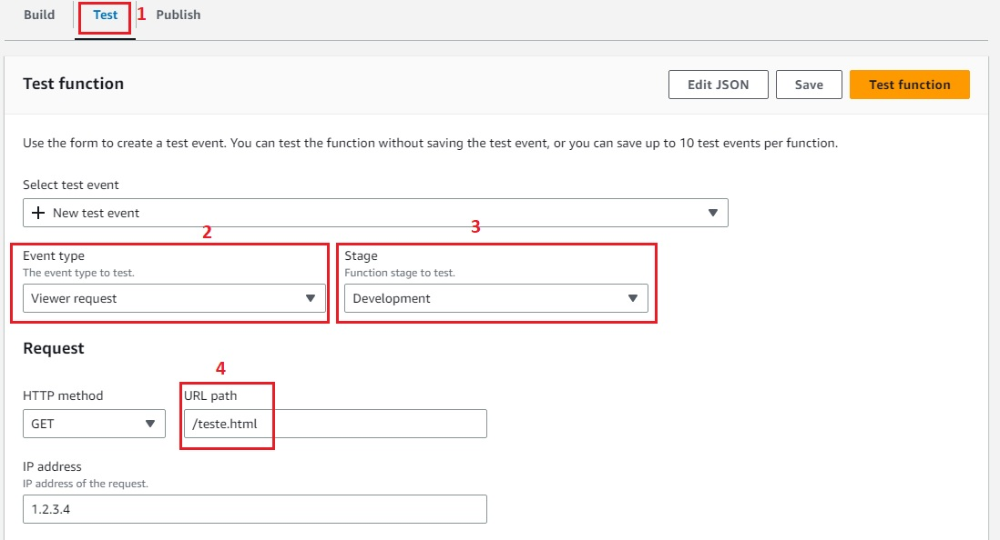
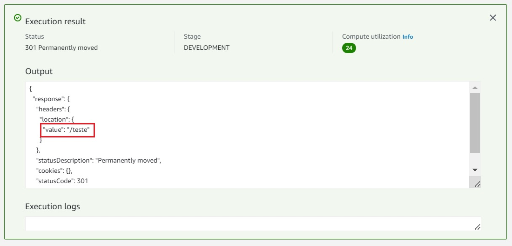
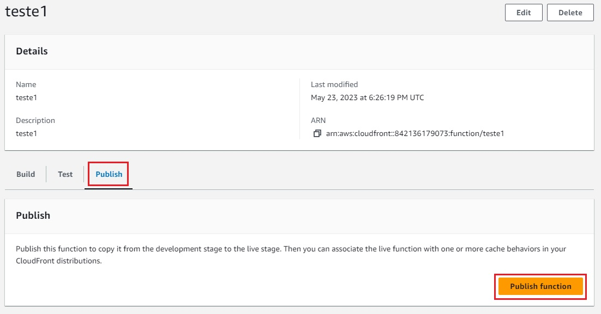
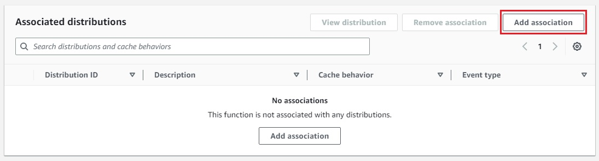
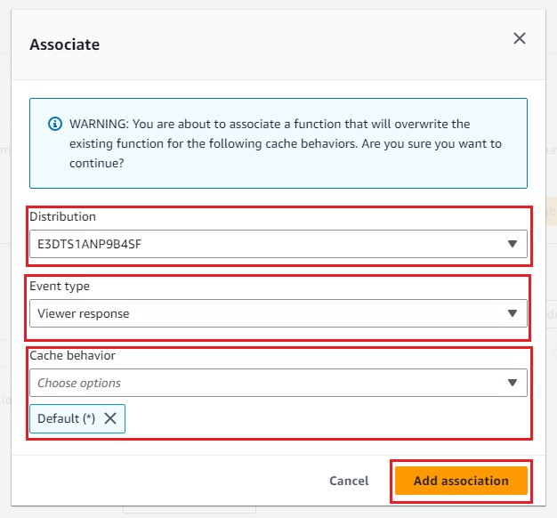

## Passo – a – Passo

Após criar a distribuição, localize, no menu do Cloudfront a esquerda, a opção “Functions” e clique.

Na próxima tela, clique no botão “Create function” a direita.

Na próxima tela, defina o nome da função e informe uma breve descrição. Após isso, clique no botão “Create function”.

Após a criação da função, na próxima tela, localize o submenu “Build” e em “Function code” localize a aba “Development”.

Ao localizar, substitua o código existente pelo seguinte código e substitua todos os pontos marcados em negritos pelos valores das suas próprias urls:

~~~javascript 
function handler(event) {
  var request = event.request;
  var rewrites = [
    ['/teste.html','/teste'],
    ['/example/test.html', '/example/index.html']
  ]

  for (var arrayIndex in rewrites){
    if (request.uri == rewrites[arrayIndex][0]) {
      var newUri = rewrites[arrayIndex][1];

      var response = {
        statusCode: 301,
        statusDescription: 'Permanently moved',
        headers: {
          "location": { "value": newUri }
        }
      }
      return response;
     }
   }
  return request;
}
~~~~

Obs.: Nesse código acima, estamos obrigando a todas as requisições que forem feitas na url terminada em _“teste.html”_ terminarem em “teste”.
Após a alteração de valores, clique em “Save changes”

Após salvar o código, clique em “Test” no menu superior ao lado de “Build”. Será necessário validar o código construído. Dessa forma, mantenha os valores em “Event type” como “Viewer request”, “Stage” como “Development” e “URL Path” com o valor que deseja que seja alterado (no exemplo “teste.html”) e clique em “Test function” para executar.

Se o teste ocorreu corretamente, os valores em “value” devem trazer a url que deseja que apareçam após ocorrer o redirecionamento (no caso apenas “teste”) caso não tenha alteração, será necessário revalidar o código.

Após o teste, será necessário publicar a função no Cloudfront. Para isso, clique na aba “Publish” no menu superior e depois clique em “Publish function”.

Após a função ter sido publicada, aparecerá (abaixo da guia de publicação) uma guia de associação para que seja a função será vinculada as distribuições do cloudfront que deseja utilizar. Basta clicar em “Add association”.

Na nova tela de associação, no campo de “Distribution” selecione a distribuição que seja vincular, em “Event type” marque como “Viewer request” e em “Cache behavior” mantenha o valor “Default” e depois clique em “Add association”.

Feito isso, as distribuições do Cloudfront estarão vinculadas ao redirecionamento automático das urls conforme desejado.